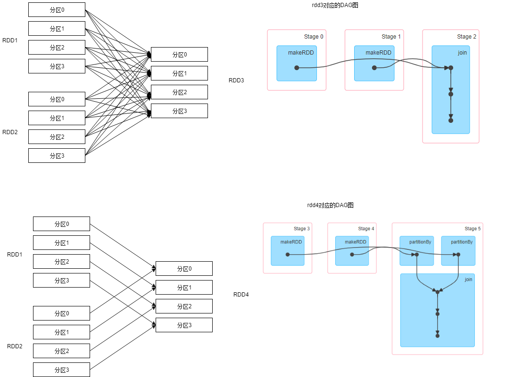

简答题：

 以下代码： 

~~~scala
import org.apache.spark.rdd.RDD
import org.apache.spark.{SparkConf, SparkContext}

object JoinDemo {
	def main(args: Array[String]): Unit = {
        val conf = new SparkConf()
        	.setAppName(this.getClass.getCanonicalName.init)
        	.setMaster("local[*]")
        val sc = new SparkContext(conf)
        sc.setLogLevel("WARN")

        val random = scala.util.Random
        val col1 = Range(1, 50).map(idx => (random.nextInt(10), s"user$idx"))
        val col2 = Array((0, "BJ"), (1, "SH"), (2, "GZ"), (3, "SZ"), (4, "TJ"), 
                         (5, "CQ"), (6, "HZ"), (7, "NJ"), (8, "WH"), (0,"CD"))
        val rdd1: RDD[(Int, String)] = sc.makeRDD(col1)
        val rdd2: RDD[(Int, String)] = sc.makeRDD(col2)
        val rdd3: RDD[(Int, (String, String))] = rdd1.join(rdd2)
        println(rdd3.dependencies)
        val rdd4: RDD[(Int, (String, String))] = 
            rdd1.partitionBy(new HashPartitioner(3))
            .join(rdd2.partitionBy(new HashPartitioner(3)))
        
        println(rdd4.dependencies)
        sc.stop()
}
}

~~~

1. 两个打印语句的结果是什么，对应的依赖是宽依赖还是窄依赖，为什么会是这个结果；

**结果：** rdd3和rdd4的依赖信息，其中rdd3对应的是宽依赖，rdd4对应的是窄依赖

**原因：** 

首先，我们需要了解什么是宽依赖，什么是窄依赖

**宽依赖：** 发生shuffle时，一定会产生宽依赖，宽依赖是一个RDD中的一个Partition被多个子Partition所依赖（一个父亲多有儿子），也就是说每一个父RDD的Partition中的数据，都可能传输一部分到下一个RDD的多个partition中，此时一定会发生shuffle

**窄依赖：** 一个RDD中的一个 Partition最多 被一个 子 Partition所依赖（一个父亲有一个儿子）

其次，我们通过代码进行分析，rdd3是通过rdd1和rdd2进行join得到的，假设我们在任务资源配置中设置4个core，则rdd1和rdd2默认会有四个分区，初始分区信息如下：

~~~scala
*********rdd1分区信息，其中part_X代表分区索引号**********
(part_0,List((9,user1), (8,user2), (8,user3), (0,user4), (3,user5), (6,user6), (1,user7), (9,user8), (4,user9), (7,user10), (3,user11), (3,user12)))

(part_1,List((7,user13), (3,user14), (8,user15), (5,user16), (6,user17), (6,user18), (3,user19), (5,user20), (8,user21), (0,user22), (6,user23), (5,user24)))

(part_2,List((2,user25), (2,user26), (9,user27), (2,user28), (5,user29), (8,user30), (1,user31), (2,user32), (9,user33), (6,user34), (2,user35), (4,user36)))

(part_3,List((3,user37), (3,user38), (2,user39), (5,user40), (2,user41), (8,user42), (0,user43), (2,user44), (2,user45), (4,user46), (0,user47), (6,user48), (3,user49)))

*********rdd2分区信息，其中part_X代表分区索引号**********
(part_0,List((0,BJ), (1,SH)))
(part_1,List((2,GZ), (3,SZ), (4,TJ)))
(part_2,List((5,CQ), (6,HZ)))
(part_3,List((7,NJ), (8,WH), (9,CD)))
~~~

通过初始分区信息，我们可以看出，rdd1初始分区是根据value进行分区的，而rdd2则是通过key进行分区的，因此，当rdd1和rdd2进行join时，一定会产生shuffle，从而是宽依赖。

rdd4进行join之前，rdd1和rdd2分别根据key的hash值进行重分区，重分区后的分区信息如下：

~~~
*********rdd1重分区信息，其中part_X代表分区索引号**********
(part_0,List((6,user1), (9,user2), (3,user3), (6,user5), (6,user7), (0,user9), (6,user13), (9,user15), (9,user18), (9,user20), (9,user21), (6,user23), (3,user26), (9,user31), (0,user33), (3,user36), (0,user40), (3,user42), (3,user46), (6,user47), (6,user49)))

(part_1,List((7,user11), (4,user14), (4,user19), (4,user25), (4,user28), (7,user30), (1,user32), (1,user34), (7,user37), (4,user38), (4,user48)))

(part_2,List((2,user4), (5,user6), (2,user8), (2,user10), (8,user12), (8,user16), (2,user17), (8,user22), (8,user24), (8,user27), (8,user29), (8,user35), (8,user39), (2,user41), (8,user43), (8,user44), (2,user45)))

*********rdd2重分区信息，其中part_X代表分区索引号**********
(part_0,List((0,BJ), (3,SZ), (6,HZ), (9,CD)))
(part_1,List((1,SH), (4,TJ), (7,NJ)))
(part_2,List((2,GZ), (5,CQ), (8,WH)))
~~~

通过重分区信息，我们可以看出，rdd1和rdd2的key值相同的数据都在分区索引号相同的分区中，因此，在join过程中，相同索引号的分区数据会到同一个分区中，并不会产生shuffle。

以下是rdd3和rdd4在shuffle中的示意图：

 通过图中我们可以发现rdd1和rdd2中每个分区数据都需要传输到rdd3的四个分区上，产生了shuffle，显然是宽依赖

而rdd1和rdd2重分区后，每个分区的数据只需要传输到对应的一个分区上，没有产生shuffle，是窄依赖

2. join 操作何时是宽依赖，何时是窄依赖；

当两个rdd进行join之前，都做过重分区的操作或者之前使用的算子中带有重分区的操作（如groupByKey），且两个rdd的分区数一致时，为窄依赖，其他情况为宽依赖

### 作业讲解视频地址

链接：https://pan.baidu.com/s/1lmBdVvu_QAdiAs--Le8nUQ 
提取码：6yb9 
复制这段内容后打开百度网盘手机App，操作更方便哦